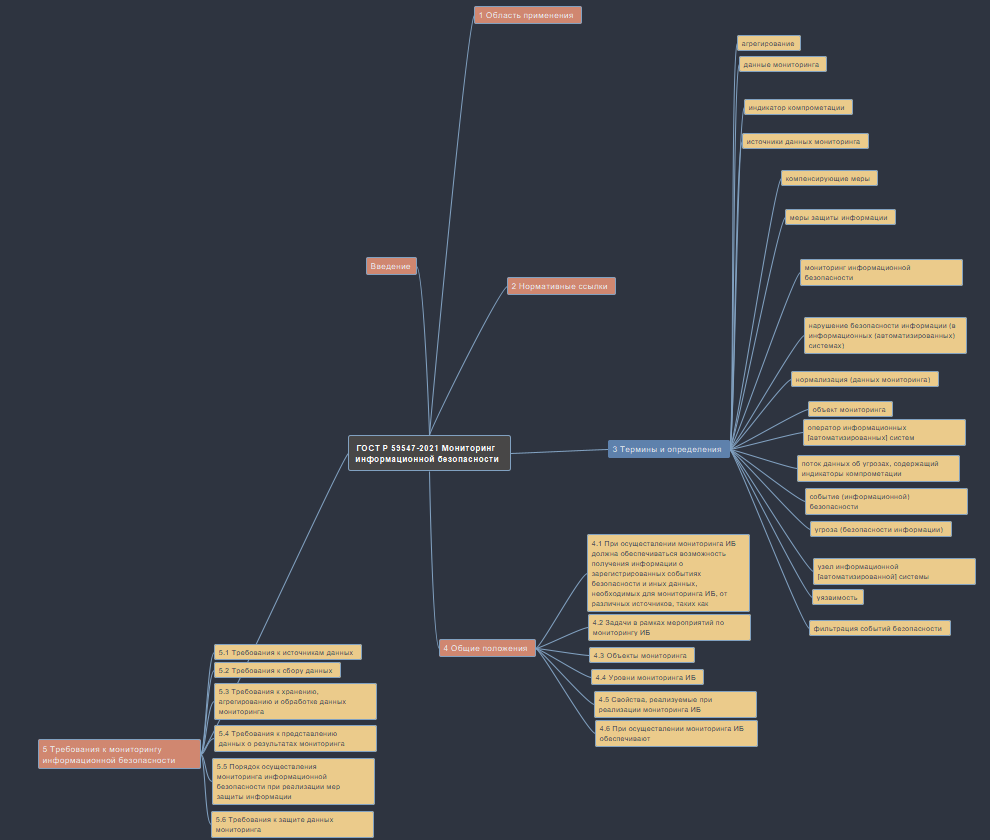

lab5

Газиков Руслан

Создание mind-карты ГОСТа

## Цель

1.  Ознакомиться с Freeplane
2.  Изучить документацию

## Исходные данные

1.  ОС Windows 10
2.  Freeplane
3.  VS Code
4.  Текст ГОСТ Р 59547-2021

## Варианты решения задачи

1.  Делать конспект в Word-е
2.  Делать mind-карту во Freeplane

## Описание шагов

### Шаг 1

Создание файла с расширением .mm, чтение документа.

### Шаг 2

Создание mind-карты. Фрагмент представлен на рисунке:

## Оценка результатов

Задача решена с Freeplane.

## Вывод

В данной работе было показано, что удобнее пользоваться современными
средствами конспектирования, например такими, как Freeplane.
